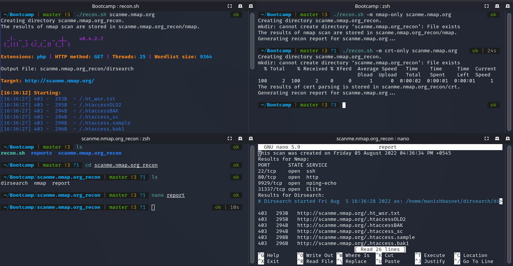

# Recon

Recon is basically a shell script with which one can automate their reconnaissance process  in a single command.During reconnaissance ,one manually use tools like nmap,dirsearch,gobuster,visit different sites like crt.sh for domain info and look each output separately . 

Well if you are bored of doing above stuff manually then let **RECON** automate it for you. Not only it automates your reconnaissance process but also gives you a proper formatted report of all scan in one file.

## Installation
#### Requirement: jq(json processor),dirsearch(python file)

```bash
git clone https://github.com/maheshbasnet089/recon.git
cd recon 
./recon.sh  [Target_Domain]
```

## Usage

```bash
./recon.sh [target_domain]

# scan MODE (more than 1 domain)
./recon.sh facebook.com fbcdn.net

# interactive mode 
./recon.sh -i 

# Uses Nmap Only  
./recon.sh -m nmap-only facebook.com

# Uses Dirsearch only
./recon.sh -m dirsearch-only facebook.com

# returns data from [CRT](https://crt.sh)
./recon.sh -m crt-only facebook.com

# Uses All(nmap,dirsearch,crt) and returns report
./recon.sh -m facebook.com
```
## Example



## Contributing
Pull requests are welcome . For major changes, please open an issue first to discuss what you would like to change.


## License
[MIT](https://choosealicense.com/licenses/mit/)
